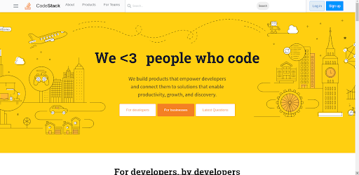

### Codestack

- Codestack is a clone of stackoverflow built using Python(Django)

### Getting Started
Follow the installation steps

### Installation
- clone the project
- setup virtual environment

https://github.com/Eric20Junior/codestack

- cd codestack
- install all the requirements

`pip install -r requirements.txt`

- To run app

`python manage.py runserver`

### Author

- Eric Rukevwe
